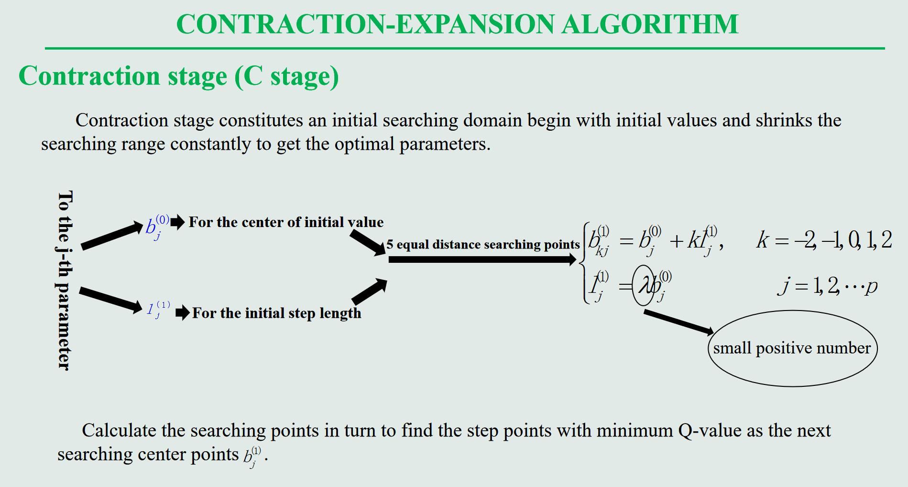
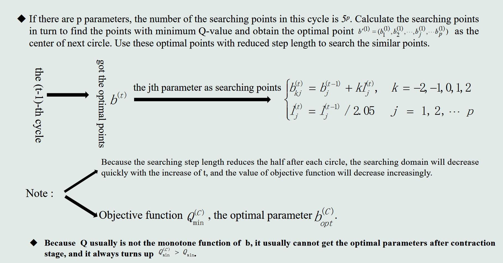

# contraction-expansion algorithm
A new contraction-expansion algorithm in fitting nonlinear equation was proposed by combining numerical derivative with previous contraction-expansion algorithm. The new algorithm could use differential equation to guide searching direction without providing derivatives, so as to simplify fitting process and raise searching efficiency. The new C-E algorithm greatly reduced computing load for those multiple parameters situation and strengthened ability to jump out off pitfalls so as to reach the global optimum. The scatter-spread of the spring points provided accurate information that search step length could be automatically and properly adjusted. This was essential to the ability and efficiency of the optimal fitting. The new algorithm was simple in the structure and easy to make the program. Some examples were given to demonstrate the power in curve and surface fitting
# CEA method
### Contraction stage (C stage)

### Expansion stage (E stage)

### Numerical differentiation

# Demo and Instance verification

